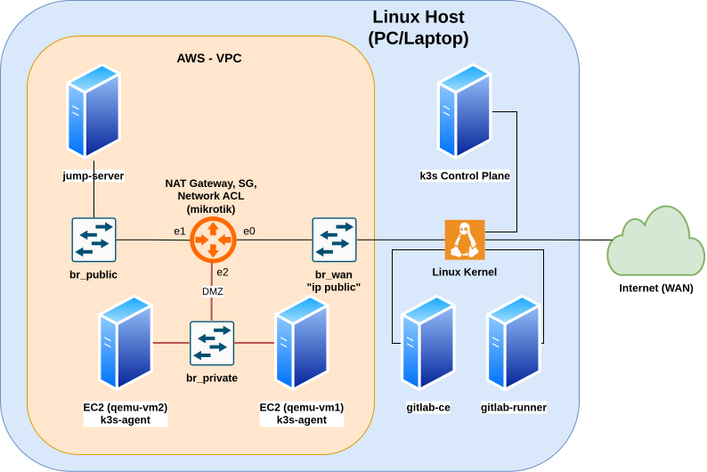

```bash
You must provide mikrotik chr image version 7, rename it to chr7.img place inside mikrotik folder.
You must provide debian 12 netinstall iso file. Rename it to deb12Netist.iso, place inside ec2vm folder.

Inside folder ec2vm run : 
qemu-img create -f qcow2 deb12base.qcow2 10G 
qemu-img create -f qcow2 -b base.qcow2 -F qcow2 js.qcow2
qemu-img create -f qcow2 -b base.qcow2 -F qcow2 vm1.qcow2
qemu-img create -f qcow2 -b base.qcow2 -F qcow2 vm2.qcow2

Inside folder mikrotik run :
qemu-img convert -f raw -O qcow2 chr7.img mikrotik7.qcow

```

1. Run `deploy-terraform.sh`: Localstack can confirmed that AWS VPC, IAM User, EC2 etc are done.
2. Run `1-infrasBuild.sh` : The local homelab infrastructure got executed.
3. Run `2-startEC2Vm.sh` : Starting the qemu-vm (EC2).

